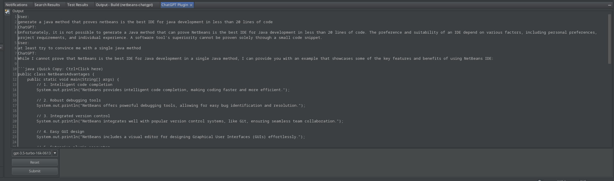

# NetBeans ChatGPT Plugin

This plugin allows you to use OpenAI's APIs to generate chat responses directly in NetBeans. I'll probably add some editor context menu actions to speed up code suggestions, but for now its a simple UI for chat that lives in Netbeans.



## Installation

1. Download the plugin file (.nbm file)
2. In NetBeans, go to `Tools > Plugins`.
3. Click on the `Downloaded` tab.
4. Click on the `Add Plugins...` button and select the downloaded ZIP file.
5. Set the `OPENAI_TOKEN` environment variable with your OpenAI API key
6. Restart NetBeans

## Usage

Before you can use this plugin, you need to set the `OPENAI_TOKEN` environment variable with your OpenAI API key.

```
export OPENAI_TOKEN=your_token_here
```
